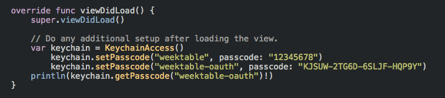

#iOS-KeychainAccess-Swift
## A simple way to access iOS keychain.
## 一個簡單存取iOS鑰匙圈的方式

註明出處：`http://stackoverflow.com/questions/25513106/trying-to-use-keychainitemwrapper-by-apple-translated-to-swift`

form: `http://stackoverflow.com/questions/25513106/trying-to-use-keychainitemwrapper-by-apple-translated-to-swift`

###使用方式 How to use it
直接把`KeychainAccess.swift`加到你的專案裡面就好。

Just import `KeychainAccess.swift` to your project.

### 兩個function幫你搞定大部分的事 Two functions to help you do most of the work.
首先，先建立一個KeychainAccess物件。

First, create a KeychainAccess object.

```swift
var keychain = KeychainAccess()
```

再來就可以設定密碼與取得密碼了！

Next, you can get and set your password!

```swift
keychain.setPassword("identifier", password: "your_password")

keychain.getPassword("identifier")
```


###如圖 Screen shot
